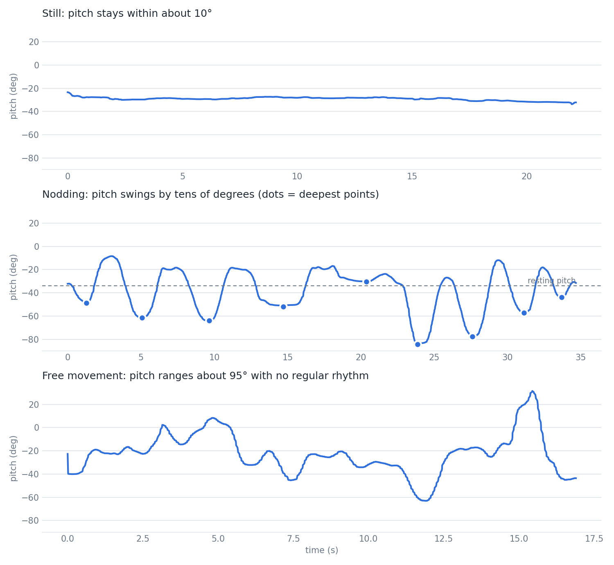

# AirPods Pro motion sensor test (2026-10-08)

App: tukuyo/AirPodsPro-Motion-Sampler, built to iPhone 15 Pro Max (iOS 26.6.2).
Recordings in `csv/`, one per motion type. Reproduce with `python3 analysis.py`.

| file | motion |
|---|---|
| 20261008_131758_motion.csv | still |
| 20261008_131825_motion.csv | nodding |
| 20261008_131902_motion.csv | free movement |

## Update interval (ms)
| motion | samples | mean | min | max |
|---|---|---|---|---|
| still | 980 | 22.6 | 1.1 | 229.4 |
| nod | 1733 | 20.0 | 1.3 | 74.8 |
| free | 845 | 20.0 | 1.3 | 70.5 |

About 50 Hz. Short bursts (~1 ms) and gaps (up to 229 ms) exist; cause not investigated.

## Axis range and std (deg)
| motion | pitch range (sd) | roll range (sd) | yaw range (sd) |
|---|---|---|---|
| still | -33.6..-23.4 (1.48) | 12.2..17.4 (0.89) | -5.5..4.7 (2.31) |
| nod | -84.3..-8.5 (18.18) | -33.6..99.2 (26.30) | -23.1..84.5 (15.21) |
| free | -63.1..31.6 (17.71) | -13.2..70.2 (14.39) | -89.6..31.5 (31.76) |

## Still: pitch wobble
sd 1.48 deg, peak-to-peak 10.3 deg, slow drift -0.16 deg/s (about -3.6 deg over 22 s).
Calmest window (5-10 s): sd 0.74 deg, peak-to-peak 2.3 deg.

## Nodding
Resting pitch about -34 deg. 16 one-way swings: mean 41 deg (7-66), mean 2.0 s (1.3-3.5).
The nod file has 9 deep troughs, more than the intended 3-5 nods.

## Notes
- Sensor values arrived only when the app was launched from Xcode; four earlier recordings were empty. Cause unconfirmed.
- File-to-motion mapping follows recording order.
